# FinanceFlow

<p align="center">
  <strong>Your finances. One clear picture.</strong>
</p>

<p align="center">
  FinanceFlow is a modern personal finance management platform that helps you track your money, plan your finances, and understand your financial activity from one unified workspace.
</p>

<p align="center">
  <a href="https://finance-flow-finance-tracker.vercel.app/">Live Demo</a>
  &nbsp;&nbsp;•&nbsp;&nbsp;
  <a href="https://docs.google.com/document/d/1lszopAGmP5ZSsPd-kSCSX8ymzYdLY-icVeLNawrpdQE/edit?usp=sharing">User Documentation</a>
  &nbsp;&nbsp;•&nbsp;&nbsp;
  <a href="https://github.com/nidhish654/FinanceFlow">GitHub Repository</a>
</p>

---

## 📸 FinanceFlow

<!-- SCREENSHOT: Replace with your actual landing page screenshot -->
<p align="center">
  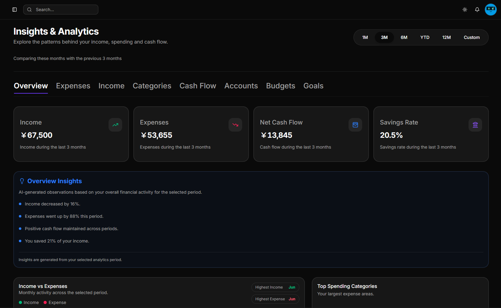
</p>

<p align="center">
  <em>FinanceFlow landing page</em>
</p>

---

# 📖 Table of Contents

- [What is FinanceFlow?](#-what-is-financeflow)
- [Core Features](#-core-features)
  - [Dashboard](#-dashboard)
  - [Accounts](#-accounts)
  - [Transactions](#-transactions)
  - [Categories](#-categories)
  - [Budgets](#-budgets)
  - [Goals](#-goals)
  - [Finance Profiles](#-finance-profiles)
  - [Analytics](#-analytics)
  - [CSV Import & Export](#-csv-import--export)
- [Getting Started](#-getting-started)
- [Understanding FinanceFlow](#-understanding-financeflow)
- [Tips for Using FinanceFlow](#-tips-for-using-financeflow)
- [Frequently Asked Questions](#-frequently-asked-questions)
- [Privacy & Your Data](#-privacy--your-data)
- [Technology](#-technology)
- [Documentation](#-documentation)
- [Feedback](#-feedback)
- [FinanceFlow Philosophy](#-financeflow-philosophy)

---

# 💡 What is FinanceFlow?

Managing personal finances often means switching between bank accounts, spreadsheets, notes, budgeting tools, and charts.

**FinanceFlow brings these activities together into one financial workspace.**

FinanceFlow allows you to:

- Track multiple financial accounts
- Record income and expenses
- Organize transactions using categories
- Create and monitor budgets
- Set and track financial goals
- Separate financial contexts using Finance Profiles
- Analyze income and expenses
- Understand spending patterns
- Import and export transaction data using CSV
- View your financial activity through a centralized dashboard

The idea behind FinanceFlow is simple:

> **Tracking your money is only the first step. Understanding it is what helps you make better decisions.**

---

# ✨ Core Features

FinanceFlow brings together the essential tools required to manage and understand your personal finances.

---

# 📊 Dashboard

The Dashboard is the central command center of FinanceFlow.

It provides an overview of your financial situation without requiring you to inspect every individual section.

Depending on your available financial data, the dashboard brings together information such as:

- Total balance
- Income
- Expenses
- Savings
- Account balances
- Recent transactions
- Budget progress
- Financial activity

<!-- SCREENSHOT: Add your actual dashboard screenshot here -->

<p align="center">
  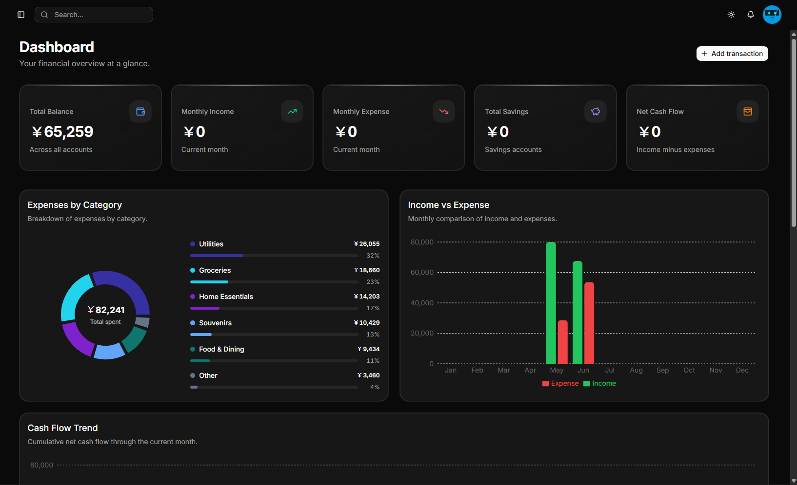
</p>

<p align="center">
  <em>FinanceFlow Dashboard</em>
</p>

The goal of the Dashboard is to answer one simple question:

> **"How are my finances looking right now?"**

---

# 💳 Accounts

FinanceFlow allows you to manage multiple financial accounts from one place.

Accounts can represent:

- Bank accounts
- Savings accounts
- Credit cards
- Cash
- Wallets
- Other financial accounts

Each account can maintain its own balance and transaction history.

This allows you to keep your financial information organized without maintaining separate spreadsheets for every account.

<!-- SCREENSHOT: Add your actual Accounts page screenshot here -->

<p align="center">
  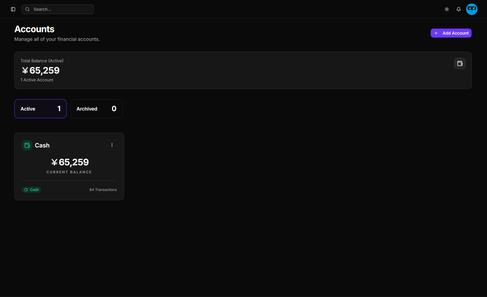
</p>

<p align="center">
  <em>FinanceFlow Accounts</em>
</p>

---

# 🔄 Transactions

Transactions represent the actual financial activity inside FinanceFlow.

You can record and manage:

- Income
- Expenses
- Transfers

Transactions can contain information such as:

- Amount
- Date
- Account
- Category
- Description
- Transaction type

Keeping a clean transaction history is important because transactions provide the foundation for budgets and analytics.

<!-- SCREENSHOT: Add your actual Transactions page screenshot here -->

<p align="center">
  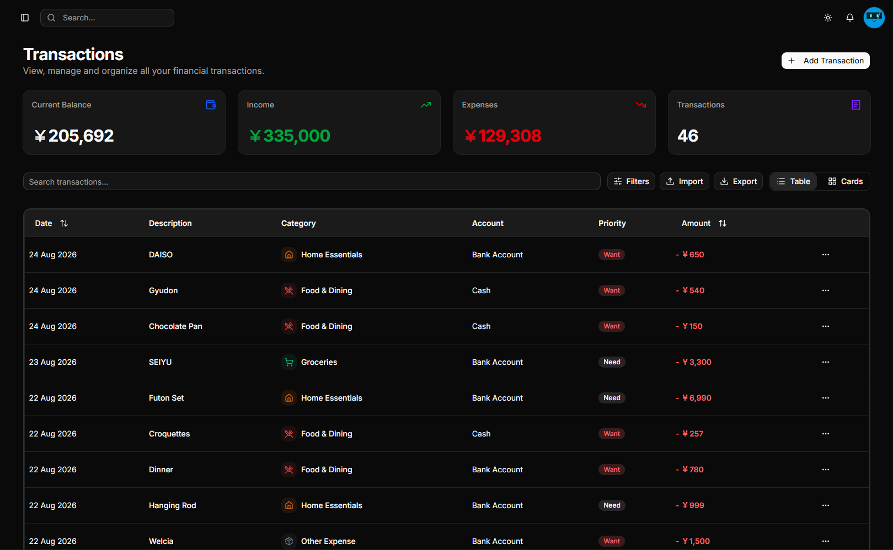
</p>

<p align="center">
  <em>FinanceFlow Transactions</em>
</p>

---

# 🏷️ Categories

Categories help organize transactions and make financial activity easier to understand.

Examples include:

- Food
- Transportation
- Shopping
- Entertainment
- Bills
- Subscriptions

Categories connect multiple areas of FinanceFlow:

**Transactions → Categories → Budgets → Analytics**

Consistently categorizing transactions makes your financial data much more useful.

<!-- SCREENSHOT: Add your actual Categories page screenshot here -->

<p align="center">
  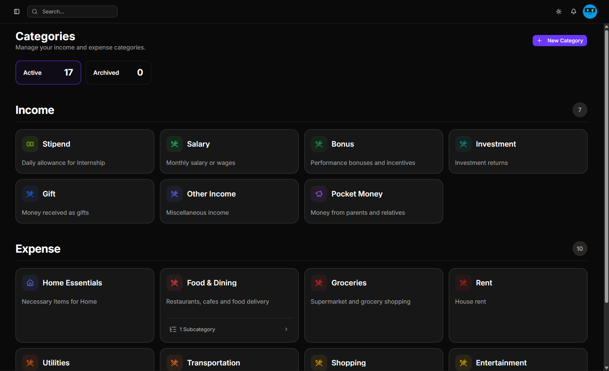
</p>

<p align="center">
  <em>FinanceFlow Categories</em>
</p>

---

# 💰 Budgets

Budgets allow you to create spending limits and monitor your progress over a specific period.

For example, you could create budgets for:

- Food
- Entertainment
- Shopping
- Transportation
- Bills
- Other recurring expenses

FinanceFlow helps you understand how much of your allocated budget has already been used.

### Budget Statuses

**🟢 Active**

The budget is currently active and within its expected range.

**🟡 Near Limit**

Spending is approaching the allocated amount.

**🔴 Over Budget**

Spending has exceeded the allocated amount.

**✅ Completed Successfully**

When a budget ends while remaining under its allocated amount, FinanceFlow recognizes the budget as successfully completed.

<!-- SCREENSHOT: Add your actual Budgets page screenshot here -->

<p align="center">
  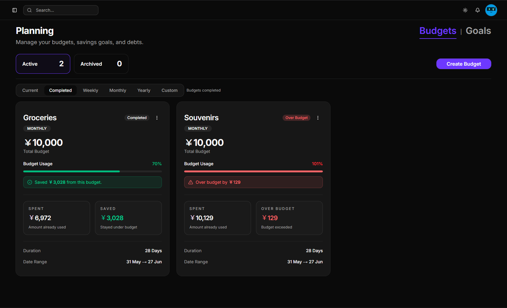
</p>

<p align="center">
  <em>FinanceFlow Budgets</em>
</p>

---

# 🎯 Goals

Financial goals help you plan for future expenses and milestones.

Examples include:

- Emergency funds
- Vacations
- New devices
- Vehicles
- Education
- Large purchases
- Long-term savings

Goals allow you to define a target and monitor your progress toward reaching it.

<!-- SCREENSHOT: Add your actual Goals page screenshot here -->

<p align="center">
  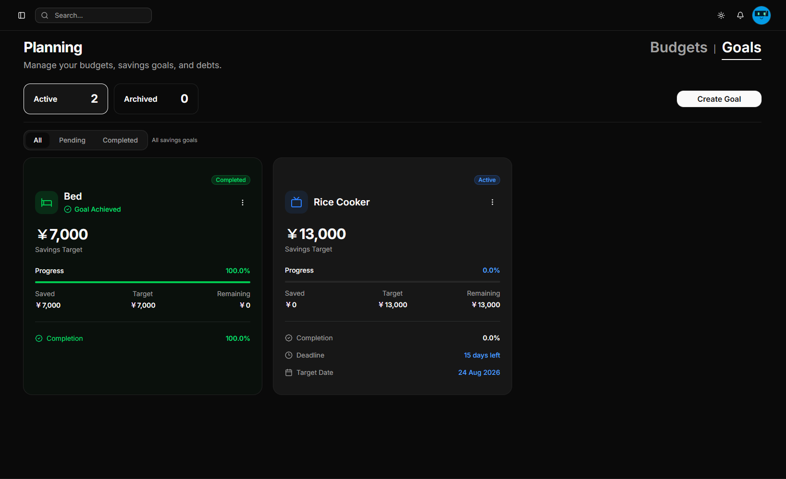
</p>

<p align="center">
  <em>FinanceFlow Goals</em>
</p>

---

# 👤 Finance Profiles

Finance Profiles allow you to separate different financial contexts while using the same FinanceFlow account.

For example:

### Personal

- Personal bank accounts
- Personal transactions
- Personal budgets
- Personal goals

### Business

- Business accounts
- Business transactions
- Business budgets

This prevents unrelated financial information from being mixed together.

<!-- SCREENSHOT: Add your actual Finance Profiles screenshot here -->

<p align="center">
  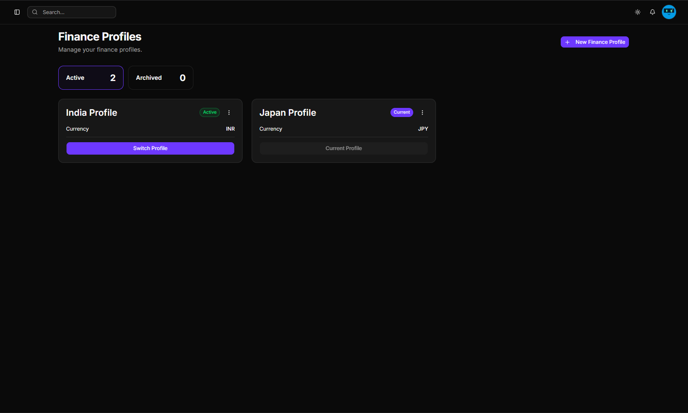
</p>

<p align="center">
  <em>Finance Profiles</em>
</p>

---

# 📈 Analytics

Analytics is one of the core parts of FinanceFlow.

FinanceFlow doesn't only record financial activity.

It helps you understand what that activity means.

The Analytics section provides different perspectives on your financial information.

---

## Overview

The Overview provides a high-level picture of your financial activity.

It helps you quickly understand important financial metrics and trends.

<!-- SCREENSHOT: Add Analytics Overview screenshot -->

<p align="center">
  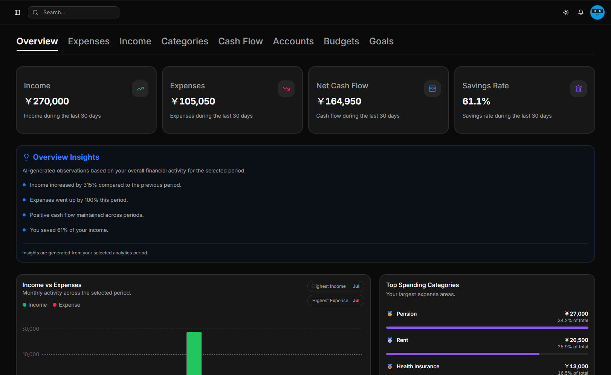
</p>

<p align="center">
  <em>Analytics Overview</em>
</p>

---

## Expenses

The Expenses section focuses on your spending activity.

It helps you understand:

- How much you spend
- Spending trends
- Spending patterns
- Where your money is going

<!-- SCREENSHOT: Add Analytics Expenses screenshot -->

<p align="center">
  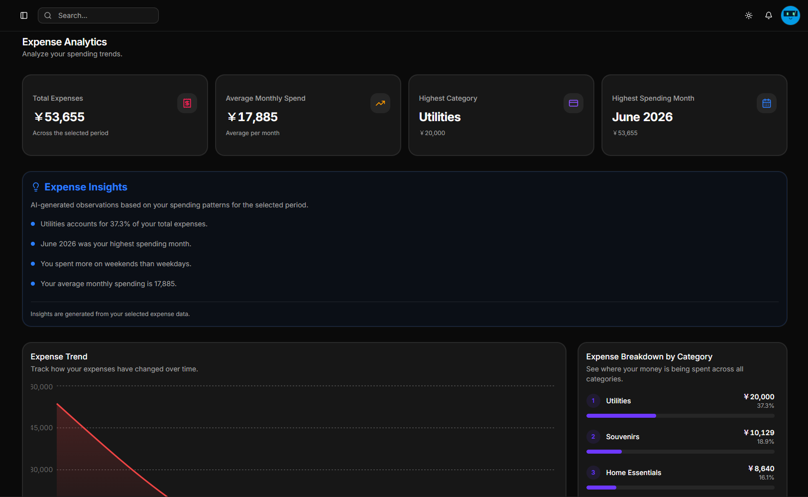
</p>

<p align="center">
  <em>Expense Analytics</em>
</p>

---

## Income

The Income section focuses on money coming into your accounts.

It allows you to understand:

- Income trends
- Changes in income
- Income patterns
- Overall income levels

<!-- SCREENSHOT: Add Analytics Income screenshot -->

<p align="center">
  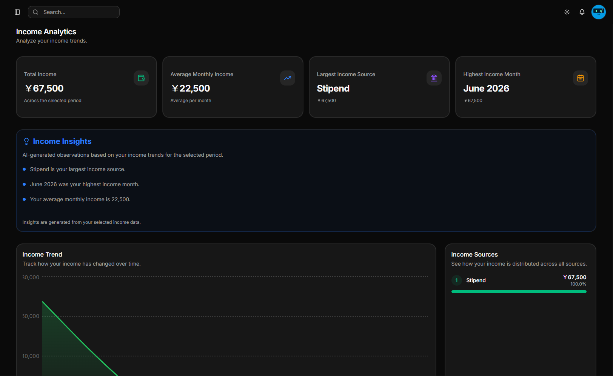
</p>

<p align="center">
  <em>Income Analytics</em>
</p>

---

## Financial Insights

Analytics can help turn raw financial activity into information that is easier to understand.

By looking at income, expenses, categories, accounts, and financial trends together, FinanceFlow helps you identify patterns in your financial behavior.

The purpose is not simply to show more charts.

The purpose is to make your financial information easier to interpret and act upon.

---

# 📁 CSV Import & Export

FinanceFlow provides CSV functionality for working with transaction data.

## Import

You can import transaction information from a CSV file.

This allows existing financial data to be brought into FinanceFlow without manually entering every transaction.

For successful imports, make sure the CSV contains valid information for the required transaction fields.

Accounts and categories referenced by imported transactions should correspond to those available in your FinanceFlow workspace.

---

## Export

FinanceFlow also allows financial data to be exported as CSV.

This makes it easier to:

- Keep a personal backup
- Analyze data externally
- Maintain your own records
- Reuse your financial information

Your financial data should remain accessible and manageable by you.

---

# 🚀 Getting Started

Getting started with FinanceFlow is simple.

## 1. Create an Account

Select **Get Started** and create your FinanceFlow account.

---

## 2. Create Your Financial Workspace

Start by setting up the financial structure you want to manage.

A good starting point is:

1. Create your Finance Profile
2. Add your financial accounts
3. Create your categories
4. Add or import transactions

---

## 3. Create Budgets

Once your transactions are available, create budgets for the areas where you want to control spending.

---

## 4. Create Financial Goals

Create goals for the financial milestones you want to achieve.

Set your target and monitor your progress.

---

## 5. Explore Analytics

Once you have sufficient financial activity, explore Analytics to understand:

- Income
- Expenses
- Categories
- Cash flow
- Account activity
- Financial trends

---

# 🔎 Understanding the FinanceFlow Workflow

FinanceFlow is designed around a simple financial workflow:

```text
                    ┌──────────────┐
                    │   Accounts   │
                    └──────┬───────┘
                           │
                           ▼
                    ┌──────────────┐
                    │ Transactions │
                    └──────┬───────┘
                           │
                     ┌─────┴─────┐
                     ▼           ▼
               Categories     Budgets
                     │           │
                     └─────┬─────┘
                           ▼
                     ┌───────────┐
                     │ Analytics │
                     └─────┬─────┘
                           │
                           ▼
                      Understand
